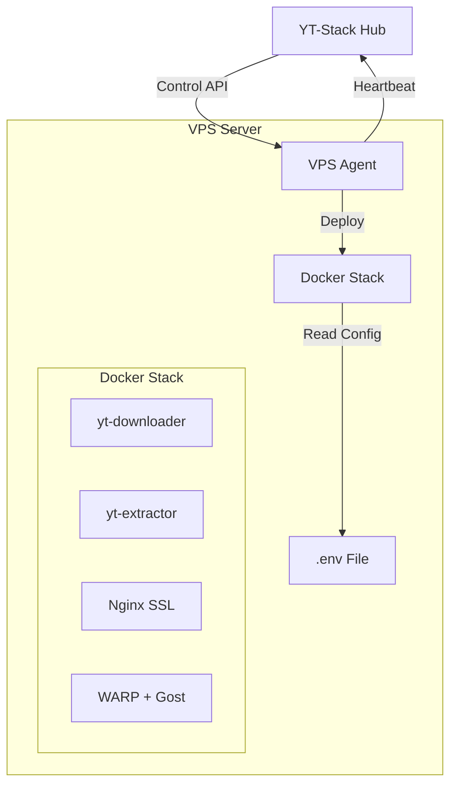

# YT-Stack: Scalable YouTube Downloader System

System download YouTube video hiệu suất cao với kiến trúc **Hub - VPS Agent**. Hỗ trợ auto-scaling, proxy management (WARP + Direct), SSL tự động, và quản lý tập trung.

## 🚀 Kiến Trúc Mới (3 Tầng)

1. **Hub (Central Management)**: Quản lý config, dashboard điều khiển restart/rebuild.
2. **VPS Agent**: Chạy trên mỗi server, tự động detect IP, fetch config, generate .env, và deploy service.
3. **YT-Downloader Service**: Core service xử lý download/stream, sử dụng Docker.



---

## ✨ Tính Năng Nổi Bật

- **Zero-Config Setup**: Cài đặt VPS mới chỉ với 1 dòng lệnh.
- **Auto-Discovery**: Tự động detect IP `103.45.67.89` -> subdomain `vps-103-45-67-89`.
- **Auto-Config**: Tự động sinh password, secrets, proxy credentials.
- **Remote Management**: Restart, Rebuild, xem Status từ Hub Dashboard.
- **Hub-Based Config**: Lưu trữ config tập trung, update và đồng bộ xuống VPS.
- **Smart Rate Limiting**: Limit băng thông theo Customer Tier (không phải Server Tier).

---

## 🛠 Cài Đặt (Quick Start)

### 1. Yêu cầu VPS
- OS: Ubuntu 20.04/22.04 hoặc Debian 11+
- RAM: Tối thiểu 2GB
- Disk: 20GB+ SSD
- Port: Open 80, 443

### 2. Setup (One-Liner)

Chạy lệnh sau trên VPS mới (với quyền root):

```bash
curl -sSL https://hub.ytconvert.org:5005/install.sh | \
  HUB_URL=https://hub.ytconvert.org:5005 \
  bash
```

**Quá trình tự động:**
1. Cài đặt Docker, Git.
2. Download **VPS Agent**.
3. Agent detect IP & Register với Hub.
4. Agent generate file `.env` (tối ưu, ~25 variables).
5. Agent build & deploy toàn bộ stack.

---

## ⚙️ Quản Lý & Vận Hành

### Truy cập Hub Dashboard
- URL: `https://hub.ytconvert.org:5005/admin`
- Login: admin / (password)

### Các thao tác trên Dashboard:
1. **View Servers**: Xem danh sách VPS, trạng thái (Online/Offline), phiên bản.
2. **Edit Config**: Chỉnh sửa thread, rate limit, credentials.
   - Sau khi sửa, click **Restart** để áp dụng.
3. **Restart VPS**: Trigger Agent restart service (tự động pull config mới).
4. **Rebuild VPS**: Trigger Agent rebuild lại docker images (khi update code).

### Kiểm tra Logs trên VPS

```bash
# Xem log của Agent
journalctl -u vps-agent -f

# Xem log của Service
cd /opt/yt-stack
docker-compose logs -f yt-downloader
```

---

## 🔧 Deep Dive: Configuration

Hệ thống sử dụng cơ chế config tối ưu, loại bỏ các biến không cần thiết.

### File `.env` (Auto-generated)
Agent tự động sinh file này tại `/opt/yt-stack/.env`.

```bash
# Core Identity
SERVER_IP=103.45.67.89
SUBDOMAIN=vps-103-45-67-89
PORT=5001

# Proxy (Auto-generated credentials)
WARP_USER=...
WARP_PASS=...
DIRECT_USER=...
DIRECT_PASS=...

# Limits & Features
DOWNLOAD_THREADS=4
MAX_FILE_SIZE_GB=5
ENABLE_MERGE=true

# Customer Tier Config (JSON)
TIER_CONFIG={"0":{"threads":2,"rate":1048576},"1":{"threads":4,"rate":2097152}}
```

**Lưu ý:** Không chỉnh sửa thủ công `.env` trên VPS. Hãy sửa trên Hub Dashboard và restart VPS.

---

## 🐛 Troubleshooting

| Vấn đề | Kiểm tra |
|--------|----------|
| VPS không hiện trên Hub | Check log agent: `journalctl -u vps-agent` |
| Service không start | Check docker: `docker-compose ps` |
| Config không cập nhật | Restart VPS từ Dashboard (để trigger config pull) |
| Download lỗi 403 | Check WARP/Proxy status |

---

## 🔒 Security

- **Agent Control API**: Port 9000 (Internal/Admin only).
- **Service API**: Port 5001 (Internal/Behind Nginx).
- **SSL**: Auto-provisioned bởi Nginx/Certbot.
- **Proxy Auth**: Gost proxy protected by random credentials.
